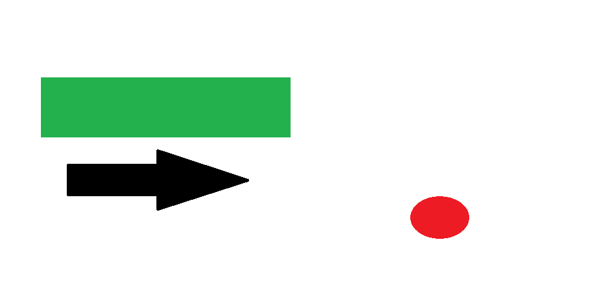
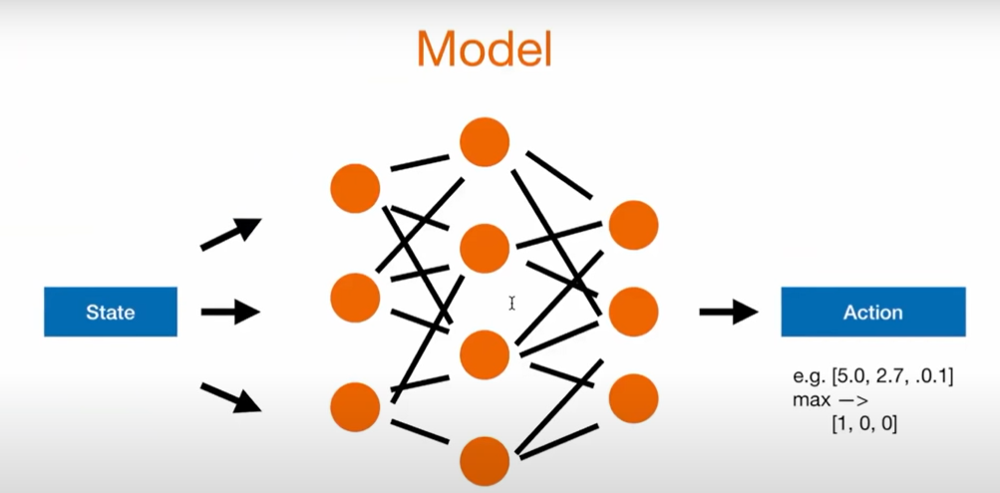
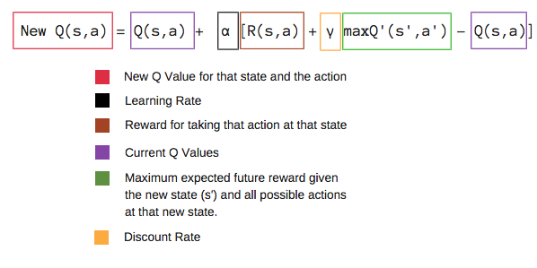

# **Train AI to play Snake Game**

The goal is to train an AI to play the Snake Game using Reinforcement Learning.

## **Reinforcement Learning**

Reinforcement Learning is a type of Machine Learning that allows machines and software agents to automatically determine the ideal behavior within a specific context, in order to maximize its performance. Simple reward feedback is required for the agent to learn its behavior; this is known as the reinforcement signal.

### *Q-Learning*

This approach extends reinforcemnte learning by using a deep neural network to approximate the actions.

## **Snake Game**

### *Reward function*:
- If the snake eats the food, the reward is $+10$
- If the snake dies, the reward is $-10$
- Otherwise, the reward is $0$

### *Snake Actions*:
- Straight $[1,0,0]$
- Right turn $[0,1,0]$
- Left turn $[0,0,1]$

### *Snake State*:
- 11 boolean values:
    - danger straight
    - danger right
    - danger left
    - direction left
    - direction right
    - direction up
    - direction down
    - food left
    - food right
    - food up
    - food down

Example:

- danger straight = False
- danger right = False
- danger left = False
- direction left = False
- direction right = True
- direction up = False
- direction down = False
- food left = False
- food right = True
- food up = False
- food down = True

### *Model*:
 It takes the state as input and outputs the action to take.

We want to improve the Q function, which takes the state and action as input and outputs the reward.

0. Initialize the Q function with the init model value
1. Chose an action based on the current state
2. Perform the action
3. Measure the reward
4. Update the Q value 
5. Train the model with the new Q value
5. *Repeat from step 1*

### *Bellman Equation*:

The bellman equation is used to update the Q value. It is based on the idea that the Q value of a state is the reward of an action plus the maximum Q value of the next state.

